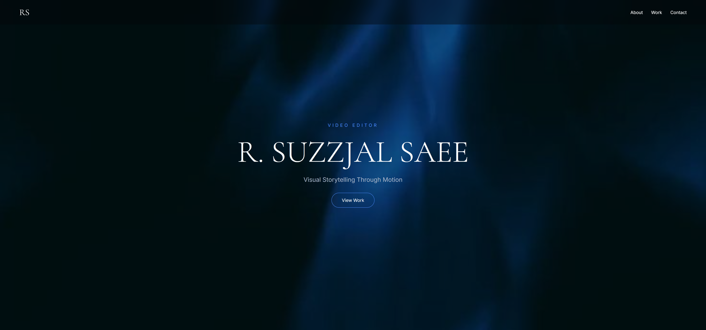
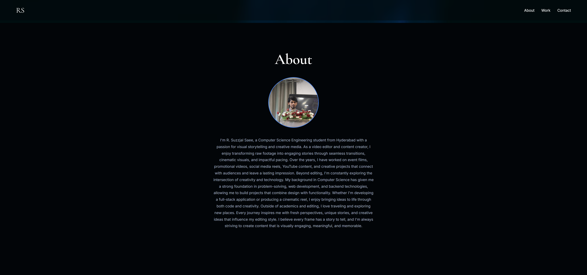
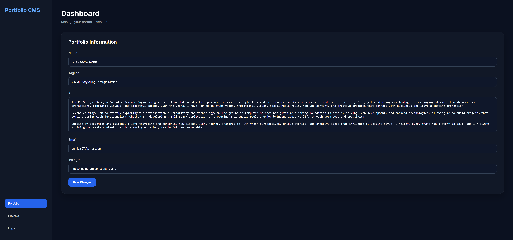
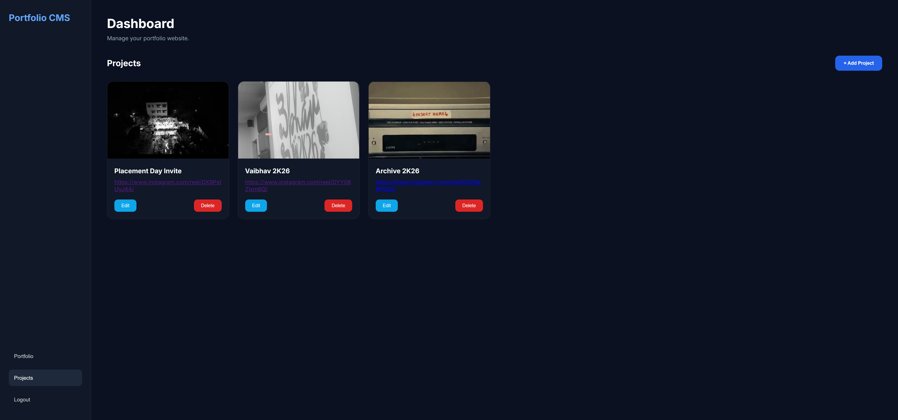

# 🚀 Portfolio CMS

<p align="center">
  
  
  
  
</p>

<p align="center">
A modern, responsive and fully dynamic Portfolio Content Management System built using HTML, CSS, JavaScript, Node.js, Express.js and MySQL.
</p>

---

## 🌐 Live Demo

### 🔗 Portfolio Website

https://suzzjal.netlify.app

### 🔗 Backend API

https://portfolio-backend-tpo1.onrender.com

### 🔗 Backend Repository

https://github.com/Stormboomop/portfolio-backend

---

# 📖 About the Project

Portfolio CMS is a full-stack web application that allows users to showcase their work through a modern portfolio website while providing a secure admin dashboard to manage all portfolio content.

Unlike a static portfolio, this project is completely dynamic. Every portfolio detail and project is stored in a MySQL database and can be updated without changing the source code.

The application follows a client-server architecture where the frontend communicates with a REST API built using Express.js, while MySQL stores portfolio information securely.

---

# ✨ Features

## Portfolio Website

- Responsive Design
- Dynamic Portfolio Information
- Dynamic Projects Section
- Project Images
- External Project Links
- Social Media Integration
- Email Contact Button

## Admin Dashboard

- Secure Login using JWT Authentication
- Edit Portfolio Details
- Add Projects
- Edit Projects
- Delete Projects
- Upload Project Images
- Image Preview Before Upload
- Responsive Dashboard UI

---

# 🛠 Tech Stack

## Frontend

- HTML5
- CSS3
- JavaScript (ES6)

## Backend

- Node.js
- Express.js
- JWT Authentication
- Multer

## Database

- MySQL

## Deployment

- Netlify
- Render
- Railway

---

# 🏗 Project Architecture

```
Portfolio CMS
│
├── Frontend (Netlify)
│
│   ├── Portfolio Website
│   ├── Admin Login
│   └── Dashboard
│
├── Backend (Render)
│
│   ├── REST API
│   ├── JWT Authentication
│   ├── Image Upload
│   └── CRUD Operations
│
└── MySQL Database (Railway)
```

---

# 📷 Screenshots

## 🏠 Homepage



## 👤 About Section



## 💼 Portfolio



## 🚀 Projects



## 🌐 Complete Website


# 🔐 Authentication

The admin dashboard is protected using JSON Web Tokens (JWT).

Authentication Flow:

- Admin Login
- JWT Token Generation
- Token Verification
- Protected Routes

---

# 📁 Backend API

| Method | Endpoint | Description |
|---------|----------|-------------|
| GET | `/api/portfolio` | Get portfolio details |
| PUT | `/api/portfolio` | Update portfolio |
| GET | `/api/projects` | Get all projects |
| POST | `/api/projects` | Add project |
| PUT | `/api/projects/:id` | Update project |
| DELETE | `/api/projects/:id` | Delete project |
| POST | `/api/upload` | Upload project image |
| POST | `/api/auth/login` | Admin Login |

---

# 🚀 Getting Started

## Clone Repository

```bash
git clone https://github.com/Stormboomop/portfolio-frontend.git
```

## Install Backend

```bash
npm install
```

## Configure Environment Variables

```env
DB_HOST=
DB_PORT=
DB_USER=
DB_PASSWORD=
DB_NAME=
JWT_SECRET=
```

## Run Backend

```bash
npm run dev
```

---

# 📂 Related Repository

Backend Repository

https://github.com/Stormboomop/portfolio-backend

---

# 📬 Contact

**Suzzjal Saee**

📧 Email: sujalsai07@gmail.com

📷 Instagram: sujal_sai_07

🌐 Portfolio: https://suzzjal.netlify.app

---

# ⭐ Acknowledgements

This project was developed as part of my learning journey in Full Stack Web Development and demonstrates deployment of a complete web application using modern technologies.

---

## 👨‍💻 Author

**Suzzjal Saee**

If you like this project, consider giving it a ⭐ on GitHub.
